# Fluorescence extraction

The purpose of these functions are to

1. Get the location (i.e. pixel map) of each cell as a distinct entity
2. Obtain these locations across time
3. Record the average intensity in the cytoplasm and nucleus for each pixel map and timepoint

N.B. I personally found the way that the LLM structured the code unhelpful for debugging, and rewrote the data structure to something that made more sense to me personally (this occurs in the worked solution after error 3) - you do not have to do this, but you might find it helps.
It also probably helps to reduce the number of images analysed (at least to start with), as you don't need to analyse every timepoint if the error is thrown at the first timepoint.

## Getting started

Navigate to `Repressilator_tests/tests` and verify that the test fails:

```bash
python -m pytest fluorescence_extractor_test.py::test_track_cells
```

We're going to be making changes to the codebase, so it's worth making a separate branch first:

```bash
git checkout -b cell_tracking_fix
```

Now we can make changes to the tests and `repressilator_analysis` module, and can choose to merge them back later. It's often worth being able to print test outputs, so you may like to add `test_track_cells()` to the end of `fluorescence_extractor_test.py`. You can then see the same test output by running:

```bash
python fluorescence_extractor_test.py
```

## The Test Functions

`test_track_cells()` calls three functions:

### `image_loader.load_timeseries()`

- **Arguments:** Location of intensity and phase directories
- **Returns:** Time of each image recording in minutes, list of extracted intensity images, list of extracted phase images

### `fluorescence_extraction.track_cells_across_time()`

- **Arguments:**
  - List of phase images provided by `load_timeseries`
  - Minimum cell area in pixels (set at 5)

**Returns** Two arguments - the first is a dictionary where each key is a cell ID mapping to a list of tuples.
The first element of each tuple is the timepoint ID, the second the currently assigned cell_id and the third element is the x,y centroid position.

```python nolint
#arg1, "tracks"
{  # Dictionary
    "1": [  # track id 
        (time1, current_id, (centre_x,centre_y)),  # Tuple
        (time2, current_id, (centre_x,centre_y)),
    ],
    "2": [ #track_id
        (time1, current_id, (3.2, 5.7)),
        ...
    ],
    ...
}
```

The second is a list of images with each cell mask given their own label

### `fluorescence_extraction.extract_nuclear_cytoplasmic()`

- **Arguments:**
  - An intensity image provided by `load_timeseries`
  - A labelled image
- **Returns:** A list of dictionaries. Each dictionary represents one cell/nucleus pair, with keys mapping to the average pixel value for that location. These cells do not need to be linked to an ID, as the test assigns each value to its closest neighbour in the true data.

## Debugging

You may find that running `test_track_cells()` without `pytest` gives a large number of deprecation warnings, presumably because of a mismatch between the documentation the LLM has looked up and the actual documentation.
These can be removed by modifying the keyword arguments in `morphology.remove_small_objects` and `morphology.remove_small_holes` in `segment_cells()` (`min_size` and `area_threshold` respectively) to both be `max_size`.

### Error 1, at timepoint 0 the number of cells is (n<80), not 80

::::challenge{id=f_err_1_assess title="What is the code doing before the error?"}

What sequence of operations are being performed before the error happens at timepoint 0 in `segment_cells()` and `track_cells_across_time()`?

:::solution

 1. The phase image is segmented using [Otsu's thresholding](https://scikit-image.org/docs/0.25.x/auto_examples/segmentation/plot_thresholding.html) (`segment_cells()`) which defines the image by two regions: light (background) and dark (cells)
 2. In `track_cells_across_time()` the non-connected dark regions are identified using `measure.label.regionprops`
 3. Each isolated region is given two unique IDs (track_id and cell_id), and passed into the `tracks` data structure, in the format [time, cell_id, (centre_x, centre_y)]

This approach assumes each connected dark region is a single cell, which breaks down when cells touch or overlap.
:::
::::

::::challenge{id=f_err_1_diagnosis title="What is causing the error?"}
Modify the code to plot the segmented image, showing the `cell_id` at each assigned cell
:::solution
Adding code like this

```python nolint
# You'll need to install and import pyplot (i.e. import matplotlib.pyplot as plt)
# After the first assignment to `tracks` in `track_cells_across_time()`
fig, (ax_phase, ax_seg) = plt.subplots(1, 2, figsize=(12, 6))
ax_phase.imshow(phase_images[0], cmap="gray")
ax_phase.set_title("Phase image (timepoint 0)")
ax_seg.imshow(labeled, cmap="nipy_spectral")
for track_id, track_list in tracks.items():
    _, _, (cy, cx) = track_list[0]
    ax_seg.text(
        cx, cy, str(track_id), color="white", fontsize=12, ha="center", va="center"
    )
ax_seg.set_title("Segmented cells at timepoint 0 (track IDs)")
plt.tight_layout()
plt.show()
```

Immediately shows us the error, which is that cells that are touching are being treated as a single cell (e.g. number 8), undercounting the true number of cells
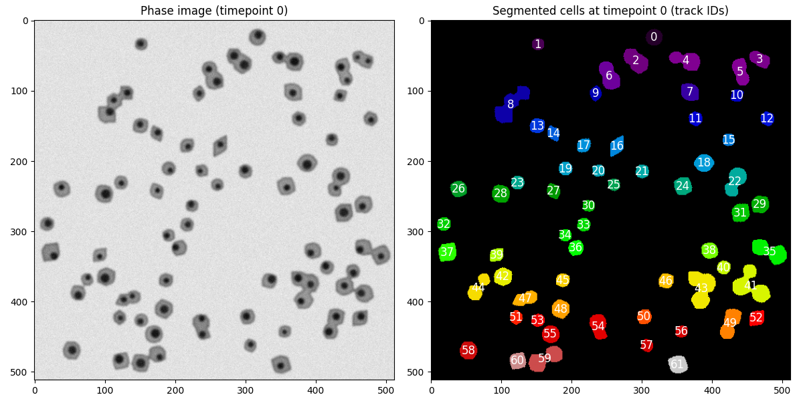
:::
::::

To resolve this we need two things: a way to count how many cells are in a merged region, and a way to draw boundaries between the cells once we know how many there are. You may find the [skimage regionprops documentation](https://scikit-image.org/docs/stable/api/skimage.measure.html#skimage.measure.regionprops) and [watershed example](https://scikit-image.org/docs/stable/auto_examples/segmentation/plot_watershed.html) useful for the steps below.

::::challenge{id=f_err_1_fix title="How can we resolve the error?"}

Given the problem identified in the prior "diagnosis" section, identify what sequence of operations is required to obtain the desired behaviour.

:::solution

We need to identify connected regions that contain multiple cells, and additionally segment the merged cluster. In practice, this means:

1. Determine how to assign regions to "merged" or "unmerged" cell labels and check how many cells are contained within each "merged" group
2. Segment accordingly, and assign each segmented cell map to the existing data structure

:::

Write some code to resolve the issue.

:::solution

The LLM implementation uses Otsu thresholding to distinguish the (dark) cells from the (light) background.
Examining the diagnostic image from before


we can see that the merged cells still have distinct nuclei.
Therefore, if we could identify regions that contain multiple nuclei, we could determine which cells need to be split.
As the nuclei are much darker than the surrounding cells, we could re-threshold each connected region.

```python nolint
# Modifying the code in the previous solution block (still in `track_cells_across_time()`)
# Cast to greyscale
gray0 = (
    np.mean(phase_images[0], axis=2)
    if phase_images[0].ndim == 3
    else phase_images[0].astype(float)
)

nuclei_per_region = {}
for region in measure.regionprops(
    labeled
):  # Iterate through each connected region (i.e. given a discrete number in ax[1] above)
    min_row, min_col, max_row, max_col = region.bbox  # identify bounding box of region
    local_phase = gray0[min_row:max_row, min_col:max_col]  # address in image
    local_mask = labeled[min_row:max_row, min_col:max_col] == region.label
    cell_pixels = local_phase[local_mask]
    if len(cell_pixels) < 10:
        continue
    thresh2 = filters.threshold_otsu(cell_pixels)  # second thresholding step
    nucleus_mask = (
        local_phase < thresh2
    ) & local_mask  # In the image, the image is under the identified threshold AND part of the region
    labeled2 = measure.label(nucleus_mask)  # Count non-connected regions
    nuclei_per_region[region.label] = (
        labeled2.max()
    )  # Each is given an integer, so max() is the total number

fig, (ax_phase, ax_seg) = plt.subplots(1, 2, figsize=(12, 6))

# Left panel: raw phase image with per-cell nucleus count overlaid at each centroid
ax_phase.imshow(phase_images[0], cmap="gray")
for region in measure.regionprops(
    labeled
):  # (It's done the same process twice, which is inefficient but whatever)
    if (
        region.label in nuclei_per_region
    ):  # The region label was added to nuclei_per_region in the loop above, with the value being the number of nuclei
        cy, cx = region.centroid
        ax_phase.text(
            cx,
            cy,
            str(nuclei_per_region[region.label]),
            color="white",
            fontsize=12,
            ha="center",
            va="center",
        )  # plotting that number
ax_phase.set_title("Phase image (timepoint 0)")

# Right panel: segmented cells coloured by label, with assigned track ID at each centroid
ax_seg.imshow(labeled, cmap="nipy_spectral")
for track_id, track_list in tracks.items():
    _, _, (cy, cx) = track_list[0]
    ax_seg.text(
        cx, cy, str(track_id), color="white", fontsize=12, ha="center", va="center"
    )
ax_seg.set_title("Segmented cells at timepoint 0 (track IDs)")
plt.tight_layout()
plt.show()
```

We can see that this has worked quite nicely! We've actually done steps 1 and 2 at the same time.

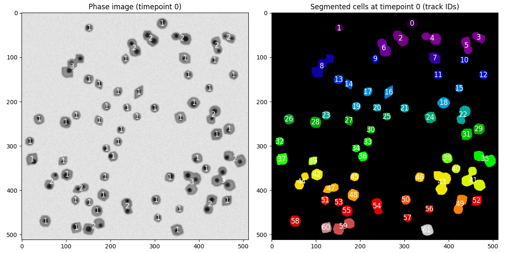

:::

We know how many cells are in a merged region, and we've already identified where their nuclei are.
What information do we have that could help us draw a boundary between them? We can't use the same thresholding trick as before, as it isn't possible to distinguish merged cells based on colour.

:::solution

There are a number of segmentation algorithms - I've used the [watershed algorithm](https://scikit-image.org/docs/stable/auto_examples/segmentation/plot_watershed.html). We update the above code to include pertinent information when `n_nuclei>1`.

```python nolint
# Modifying the code in the previous solution block (still in `track_cells_across_time()`)
# You'll need to import `feature` and `color` from skimage for this to work
regions_to_split = {}
nuclei_per_region = {}
for region in measure.regionprops(labeled):
    min_row, min_col, max_row, max_col = region.bbox
    local_phase = gray0[min_row:max_row, min_col:max_col]
    local_mask = labeled[min_row:max_row, min_col:max_col] == region.label
    cell_pixels = local_phase[local_mask]
    if len(cell_pixels) < 5:
        continue
    thresh2 = filters.threshold_otsu(cell_pixels)
    binary2 = (local_phase < thresh2) & local_mask
    labeled2 = measure.label(binary2)
    n_nuclei = labeled2.max()
    nuclei_per_region[region.label] = n_nuclei
    # As in previous solution block
    if n_nuclei > 1:
        regions_to_split[region.label] = (
            region.bbox,
            binary2,
            local_mask,
            n_nuclei,
        )  # store extra details

    # Watershed-split each merged region, updating `labeled` in-place.
    next_label = labeled.max() + 1
    for region_label, (bbox, binary2, local_mask, n_nuclei) in regions_to_split.items():
        min_row, min_col, max_row, max_col = bbox
        distance = ndimage.distance_transform_edt(binary2)
        coords = feature.peak_local_max(
            distance, footprint=np.ones((3, 3)), labels=binary2
        )
        if len(coords) == 0:
            continue
        markers = np.zeros(distance.shape, dtype=int)
        for i, coord in enumerate(coords, start=1):
            markers[tuple(coord)] = i
        ws_labels = segmentation.watershed(-distance, markers, mask=local_mask)
        # As in skimage tutorial
        local_view = labeled[min_row:max_row, min_col:max_col]
        local_view[local_mask] = 0
        for sub_id in np.unique(ws_labels):
            if sub_id == 0:
                continue
            local_view[ws_labels == sub_id] = next_label
            next_label += 1
        # for diagnostic plots
        # I'm pretty sure "labeled" was changed by reference above, which I don't like particularly, but it's fine for diagnostics
    fig, ax_phase = plt.subplots()
    #  phase image with watershed segments as solid colour blocks overlaid
    phase_norm = gray0 / gray0.max() if gray0.max() > 0 else gray0
    ax_phase.imshow(color.label2rgb(labeled, image=phase_norm, bg_label=0, alpha=0.4))
    ax_phase.set_title("Phase image (timepoint 0)")
    plt.tight_layout()
    plt.show()
```

This gets us something like this, which doesn't look super helpful

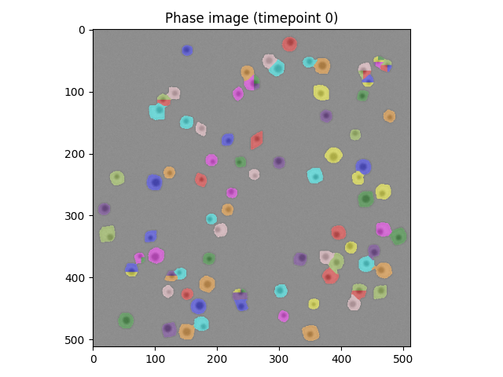

:::

If you looked in the previous solution block, you'll see the initial watershed segmentation isn't great.
Let's try and diagnose the issue

:::solution

The first problem is that we have more segments than cells. However, we know the number of segments we want - it's n_nuclei. We can update the peak finding function call accordingly

```python nolint
coords = feature.peak_local_max(
    distance, footprint=np.ones((3, 3)), labels=binary2, num_peaks=n_nuclei
)
```

This gets us a result that's a bit better, but still not perfect

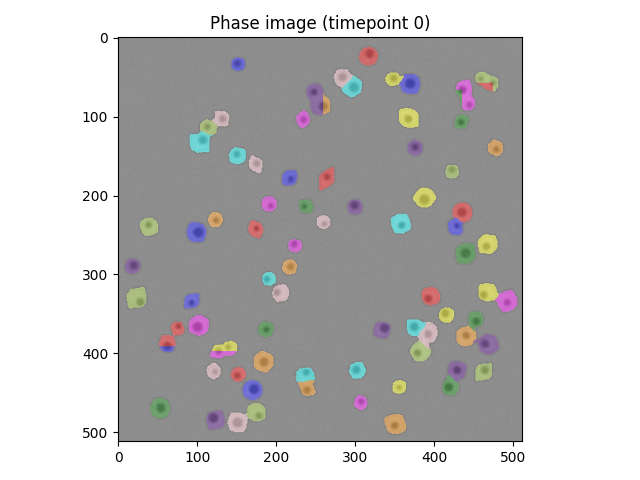

Some of the segmentations are cutting the nuclei in half.
Let's see what the watershed algorithm actually starts from

```python nolint
# In the segmentation loop
fig, ax = plt.subplots()
ax.imshow(gray0[min_row:max_row, min_col:max_col], cmap="gray")
ax.scatter(coords[:, 1], coords[:, 0], c="red", s=20, marker="+", linewidths=1)
ax.set_title(f"Region {region_label} peaks")
plt.show()
```

We can see that the peak maximums are sometimes next to each other.

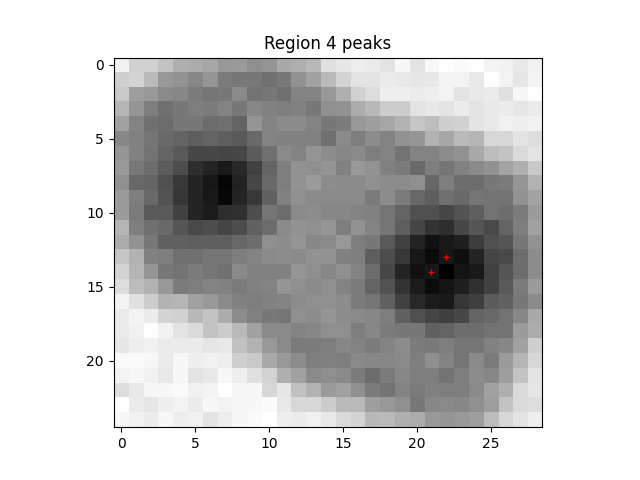

Fortunately, we can pass another argument to `peak_local_max` to prevent this

```python nolint
coords = feature.peak_local_max(
    distance,
    footprint=np.ones((3, 3)),
    labels=binary2,
    num_peaks=n_nuclei,
    min_distance=3,
)
```

:::

Up to this point in the solution blocks, we've got a sequence of steps that does at least some of the job of segmentation. We'll move the logic into `segment_cells()`, and take the opportunity to create a new data structure `cell_atlas`, to make things easier to keep track of.

:::solution

At this point, I've changed the data structure to make it easier for myself to understand

```python nolint
# Modifying code in the previous solution block#
gray0 = (
    np.mean(phase_images[0], axis=2)
    if phase_images[0].ndim == 3
    else phase_images[0].astype(float)
)
cell_atlas = []  # new data structure
cell_id = 0
next_label = labeled.max() + 1
for region in measure.regionprops(labeled):
    min_row, min_col, max_row, max_col = region.bbox
    bbox = (min_row, min_col, max_row, max_col)
    local_phase = gray0[min_row:max_row, min_col:max_col]
    local_mask = labeled[min_row:max_row, min_col:max_col] == region.label
    cell_pixels = local_phase[local_mask]
    if len(cell_pixels) < 5:
        continue
    thresh2 = filters.threshold_otsu(cell_pixels)
    nucleus_mask = (local_phase < thresh2) & local_mask
    n_nuclei = measure.label(nucleus_mask).max()
    # As in previous solution

    if n_nuclei > 1:  # Too many nuclei i.e. need further segmentation
        distance = ndimage.distance_transform_edt(
            nucleus_mask
        )  # As for the skimage watershed segmentation example
        coords = feature.peak_local_max(
            distance,
            footprint=np.ones((3, 3)),
            labels=nucleus_mask,  # Start the segmentation from the nuclei
            num_peaks=n_nuclei,  # We know how many segments we want (number of nuclei), so preset it
            min_distance=3,  # Prevent the same nuclei being used as the segmentation start point twice
        )
        if len(coords) == 0:
            continue
        markers = np.zeros(distance.shape, dtype=int)
        for i, coord in enumerate(coords, start=1):
            markers[tuple(coord)] = i
        ws_labels = segmentation.watershed(-distance, markers, mask=local_mask)
        ws_centroids = {
            p.label: p.centroid for p in measure.regionprops(ws_labels)
        }  # Get the centres for test compatibility
        # This is all as in the skimage watershed tutorial
        local_view = labeled[
            min_row:max_row, min_col:max_col
        ]  # For diagnostic plotting
        local_view[local_mask] = 0
        for ws_label in range(1, ws_labels.max() + 1):
            local_ws_mask = (
                ws_labels == ws_label
            )  # Extract the mask for each watershed segment one at a time
            local_view[local_ws_mask] = next_label  # For diagnostic plotting
            cy, cx = ws_centroids[ws_label]
            next_label += 1
            cell_atlas.append(
                {  # Save the cell_id, segment mask, nucleus mask and image bounding box
                    "cell_id": cell_id,
                    "bbox": bbox,
                    "cell_mask": local_ws_mask,  # watershed segment
                    "nucleus_mask": nucleus_mask
                    & local_ws_mask,  # intersection of watershed segment and nucleus mask
                    "centre": (
                        min_row + cy,
                        min_col + cx,
                    ),  # Get the centre for test compatibility
                }
            )
            cell_id += 1
    else:  # 1 nucleus
        ys, xs = np.where(local_mask)
        cell_atlas.append(
            {  # Saving the same data as above
                "cell_id": cell_id,
                "bbox": bbox,
                "cell_mask": local_mask,
                "nucleus_mask": nucleus_mask,
                "centre": (min_row + float(ys.mean()), min_col + float(xs.mean())),
            }
        )
        cell_id += 1
    #  phase image with watershed segments overlaid, annotated with cell_id
fig, ax_phase = plt.subplots()
phase_norm = gray0 / gray0.max() if gray0.max() > 0 else gray0
ax_phase.imshow(color.label2rgb(labeled, image=phase_norm, bg_label=0, alpha=0.4))
for entry in cell_atlas:
    min_row, min_col, max_row, max_col = entry["bbox"]
    ys, xs = np.where(entry["cell_mask"])  # Number goes in centre of bbox
    ax_phase.text(
        min_col + xs.mean(),
        min_row + ys.mean(),
        str(entry["cell_id"]),  # Now using the ID from cell_atlas
        color="white",
        fontsize=12,
        ha="center",
        va="center",
    )
ax_phase.set_title("Phase image (timepoint 0)")
plt.show()
```

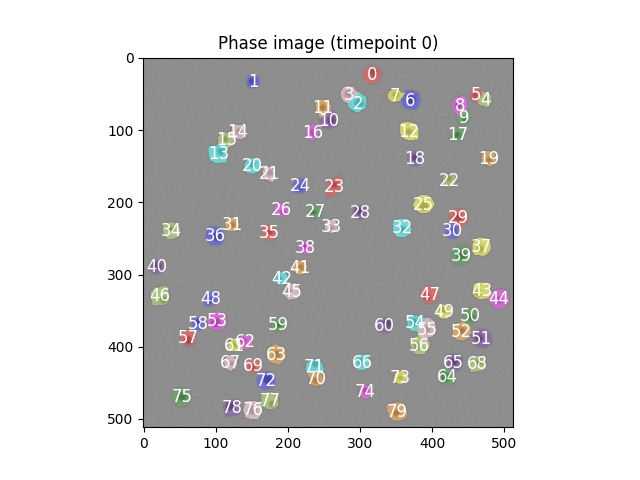

Which looks like it's worked. Let's move all the processing code to `segment_cells`

```python nolint
def segment_cells(args):
    # Rest of the code in here
    return labeled, cell_atlas
```

And update the calls to segement cells i.e

```python nolint
# In `track_cells_across_time()`
# Timepoint 0
labeled, cell_atlas = segment_cells(phase_images[0], min_cell_area)
# Update the `tracks` structure from `cell_atlas`
for i in range(0, len(cell_atlas)):
    tracks[i] = [
        (
            0,
            cell_atlas[i]["cell_id"],
            (cell_atlas[i]["centre"][0], cell_atlas[i]["centre"][1]),
        )
    ]
# In the t loop, also update the call to `segment_cells()`. We'll make everything play nice together later.
curr_labels, cell_atlas = segment_cells(phase_images[t], min_cell_area)
```

It hasn't completely fixed the issue, but we've got a different error message now.

:::
::::

### Error 2, at the first timepoint >0 cell centres have been assigned incorrectly

This error appears in some implementations and not others, depending on how centroids are calculated.
The diagnostic approach below is useful regardless of whether you encounter it.
The error arises because, even if 80 cells have been correctly segmented from the first phase image, the location of some of those cells is incompatible with the actual known truth.
Looking at the figure from the last solution block again.
If you have your own implementation it's likely that the error is one of

1. The segmentation code has produced 80 cells but they are improperly segmented
2. Your calculation of the centre point is incorrect
3. Your segmentation is completely wrong

::::challenge{id=f_err_2_diagnosis title="What is causing the error?"}
Briefly modify the test code (i.e `test_track_cells()`) to diagnose the error.

:::solution

```python nolint
# Just before the error check (i.e. `raise ValueError(f"At the first timepoint, {num_errors} cell centres have been assigned incorrectly")`)
phase_display = test_images["phase_images"][0]
fig, ax = plt.subplots(figsize=(10, 10))
ax.imshow(phase_display, cmap="gray")
ax.scatter(
    positions[:, 1],
    positions[:, 0],
    c="lime",
    s=30,
    label="correct",
    marker="o",
    zorder=3,
)
ax.scatter(
    [t["centre"][1] for t in tracks[0]],
    [t["centre"][0] for t in tracks[0]],
    c="red",
    s=30,
    label="assigned",
    marker="x",
    zorder=3,
)
ax.legend()
ax.set_title("Phase image t=0: correct (green) vs assigned (red)")
plt.show()
```

This is what the output should look like when the error isn't thrown

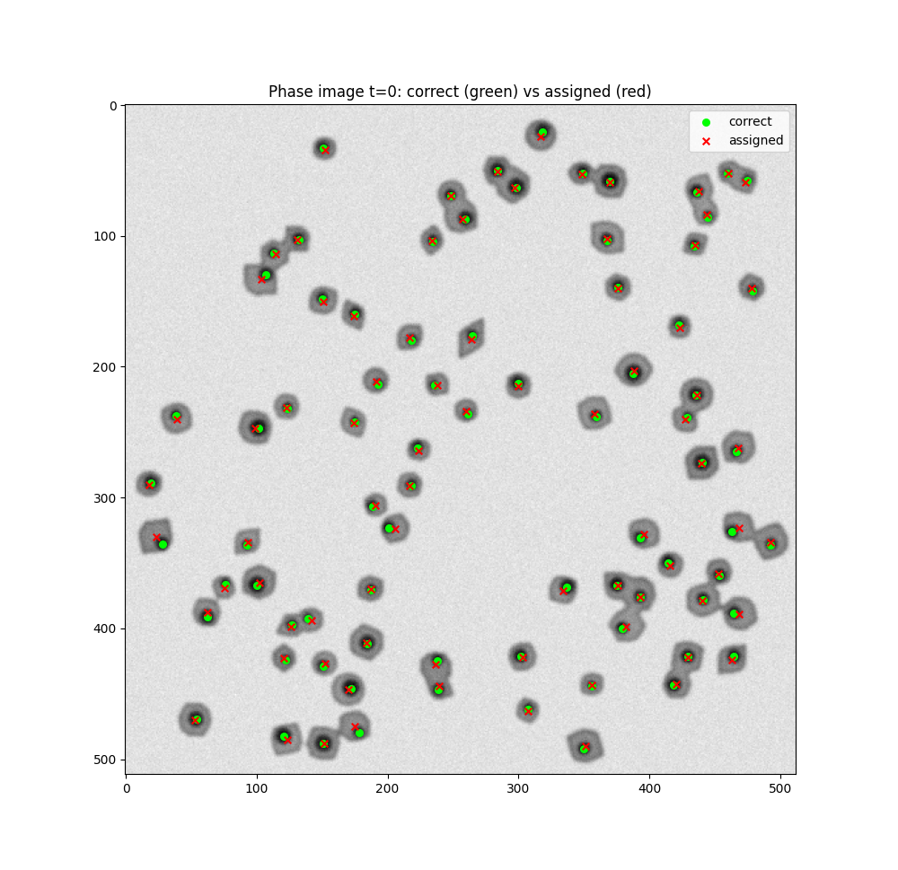

:::
::::

### Error 3, at time t, cell_id N has been incorrectly assigned to true index X, expected true index Y

::::challenge{id=f_err_3_assess title="What is the code doing before the error?"}

How does the `track_cells_across_time()` function track cells?

:::solution

1. Segments the image (at time t) using `segment_cells()`
2. Uses `regionprops` to iterate through each segment
3. Assesses the overlap between each segment at t, and each segment at t-1
4. Finds the two segments with greatest overlap, gets the cell_id from t-1 and assigns the current segment to t using the same cell_id
5. Handles any new cells (for the purposes of this exercise we know that there are no new cells appearing however)

:::
::::

::::challenge{id=f_err_3_diag title="Diagnosing the error"}

Briefly add some diagnostic plotting code to the test function to show the phase image and assigned cell_ids at time `t` and time `t-1` when the error is raised

:::solution

```python nolint
# This is in `fluorescence_extractor_test.py`
# just after the `if mapping.get(cell_id) != true_idx` check
fig, axes = plt.subplots(1, 2, figsize=(14, 7))
for ax, t_idx, t_tracks, title in [
    (axes[0], i - 1, tracks[i - 1], f"t={i-1}"),
    (axes[1], i, tracks[i], f"t={i}"),
]:
    ax.imshow(phase_images[t_idx], cmap="gray")
    ax.set_title(title)
    for cell in t_tracks:
        cy, cx = cell["centre"]
        color = "yellow"
        ax.text(
            cx,
            cy,
            str(cell["cell_id"]),
            color=color,
            fontsize=12,
            ha="center",
            va="center",
        )
fig.suptitle(
    f"Mismatch: cell_id {cell_id} assigned true_idx {true_idx}, "
    f"expected {expected_true_idx}"
)
plt.tight_layout()
plt.savefig(f"tracking_mismatch_t{i}_cell{cell_id}.png", dpi=150)
plt.show()
```

The assignments are completely different, and in t=1, a bunch of new cell_ids have been created!

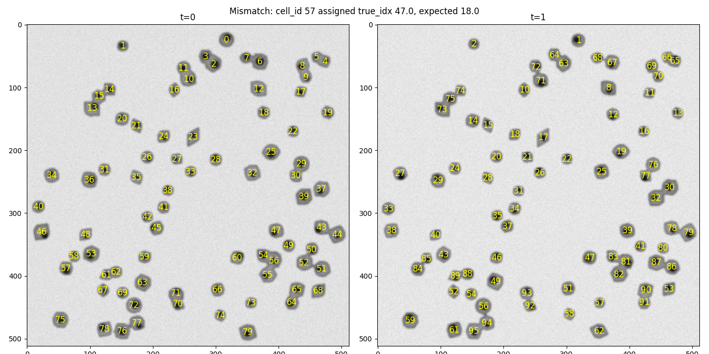

:::
::::

::::challenge{id=f_err_3_fix title="How can we resolve the error?"}

Personally I don't think the LLM solution to the tracking problem here is very good; using the cell segments and `regionprops` seems to provide very poor assignments. Are there any other features you could use to check distances between timepoints? There are two insights you need to get the code working (for the t0->t1 case at least), both of which are in the following solution block

:::solution

We'll be using the cell_atlas data structure from the previous solution blocks as well.
The key insights are:

1. You can track the cells using the centre of the cell mask (`cell_atlas["centre"]` here, but however you want to calculate and store it)
2. For each "centre" at t-1, we want to find the closest "centre" at t.
3. However, if we optimise this value individually for each "centre" (i.e. a greedy approach) there will be conflicts (e.g. a centre at t being close to two plausible centres at t-1)
4. So we actually want to find the best compromise. This is also known as minimum weight bipartite matching, and is very nicely implemented in `scipy.optimize.linear_sum_assignment`, which you'll need to import. Each cell at t-1 must be paired with exactly one cell at t, and we want the pairing that minimises the total distance travelled across all cells, as opposed to greedily matching each cell to its nearest neighbour, which can cause conflicts.

```python nolint
# In the loop of `track_cells_across_time()`
cell_id_to_track_id = {entry["cell_id"]: i for i, entry in enumerate(cell_atlas)}
prev_atlas = cell_atlas
for t in range(1, len(phase_images)):
    # Segment current frame
    curr_labels, cell_atlas = segment_cells(phase_images[t], min_cell_area)
    labeled_images.append(curr_labels)

    # Build cost matrix of distances between each previous and current cell centre
    cost_matrix = np.zeros((len(prev_atlas), len(cell_atlas)))
    for i in range(cost_matrix.shape[0]):
        for j in range(cost_matrix.shape[1]):
            cost_matrix[i, j] = np.linalg.norm(
                np.array(prev_atlas[i]["centre"]) - np.array(cell_atlas[j]["centre"])
            )
    # Find optimal assignment minimising total displacement
    row_ind, col_ind = linear_sum_assignment(cost_matrix)

    # Map matched current cell_ids to the same track as their previous counterpart
    new_cell_id_to_track_id = {}
    for r, c in zip(row_ind, col_ind):
        track_id = cell_id_to_track_id[
            prev_atlas[r]["cell_id"]
        ]  # look up track from previous cell_id
        tracks[track_id].append(
            (t, cell_atlas[c]["cell_id"], tuple(cell_atlas[c]["centre"]))
        )
        new_cell_id_to_track_id[cell_atlas[c]["cell_id"]] = (
            track_id  # register current cell_id under same track
        )
    matched_cols = set(col_ind)
    for j, curr in enumerate(cell_atlas):
        if j not in matched_cols:
            tracks[next_track_id] = [
                (
                    t,
                    curr["cell_id"],
                    tuple(curr["centre"]),
                    curr["bbox"],
                    curr["nucleus_mask"],
                    curr["cell_mask"],
                )
            ]
            new_cell_id_to_track_id[curr["cell_id"]] = next_track_id
            next_track_id += 1

    cell_id_to_track_id = new_cell_id_to_track_id  # update map for next iteration
    prev_atlas = cell_atlas
```

Moving the plotting code out of the error block shows that it's worked.
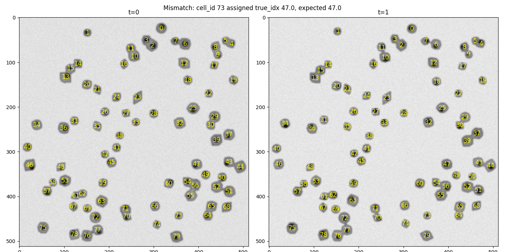

:::
::::

### Error 4, at timepoint t, fluorescence value extraction in `cytoplasm/nuclear` over distance threshold to true value (mean difference x, s.d. y)

So, we've successfully segmented the cells in t=0 and t=1, and have assigned the cells ids correctly, between t0 and t1. This error is about extracting the fluorescence value. The LLM implementation uses the labelled image, but, if you've been using the `cell_atlas` approach (the rewrite as defined in the previous solution blocks), we have a `bbox` key and two `mask` keys to provide the location of each cell in each image. I would recommend very slightly re-writing the test function to pass a data structure like this, rather than the labelled image itself. Alternatively, you can write your code so that the nuclei and cytoplasmic regions are given separate labels.

::::challenge{id=f_err_4_diag title="Diagnosing and fixing the error"}
Rewrite to use `cell_mask`, etc. keys from the previous solution. If you're not using the `cell_atlas` approach, you'll need to at least pass two labelled images, one with cell masks and one with the nuclei masks.

:::solution

In `track_cells_across_time()`

```python nolint
# at t=0, we're now also passing the bounding box, nuclear mask and cell mask assigned to each cell
tracks[i] = [
    (
        0,
        entry["cell_id"],
        (entry["centre"][0], entry["centre"][1]),
        entry["bbox"],
        entry["nucleus_mask"],
        entry["cell_mask"],
    )
]
# ...
# at t=1,2,...
curr = cell_atlas[c]
tracks[track_id].append(
    (
        t,
        curr["cell_id"],
        tuple(curr["centre"]),
        curr["bbox"],
        curr["nucleus_mask"],
        curr["cell_mask"],
    )
)
```

In `test_track_cells()`

```python nolint
results = ra.fluorescence_extraction.extract_nuclear_cytoplasmic(
    intensity_images[i],
    tracks[i],
)
# we're now passing the `tracks` data structure rather than a series of labelled imaged, which we can now process in `extract_nuclear_cytoplasmic()`
```

:::
Modify `extract_nuclear_cytoplasmic()` to check which sections of the intensity image are having their fluorescence values extracted.
:::solution

```python nolint
def extract_nuclear_cytoplasmic(
    intensity_image: np.ndarray,
    track_entries: List[dict],  # Now it's the tracks data structure
    nuclear_channel: str = "red",
    cytoplasmic_channel: str = "green",
) -> List[Dict[str, float]]:
    """
    Extract nuclear and cytoplasmic fluorescence for each cell.

    Args:
        intensity_image: RGB fluorescence image
        track_entries: List of track tuples for a single timepoint, each of the form
                       (timepoint_idx, cell_label, (y, x), bbox, nuclear_mask, cell_mask)
                       where bbox is (min_row, min_col, max_row, max_col) and the masks
                       are boolean arrays cropped to that bounding box.
        nuclear_channel: Color channel for nuclear fluorescence (default: 'green')
        cytoplasmic_channel: Color channel for cytoplasmic fluorescence (default: 'red')

    Returns:
        List of dictionaries with keys 'nuclear' and 'cytoplasmic' containing
        mean fluorescence intensities for each cell
    """
    channel_map = {"red": 0, "green": 1, "blue": 2}
    nuclear_idx = channel_map[nuclear_channel.lower()]
    cyto_idx = channel_map[cytoplasmic_channel.lower()]
    # diagnostics
    nuclear_mask_full = np.zeros(intensity_image.shape[:2], dtype=bool)
    cyto_mask_full = np.zeros(intensity_image.shape[:2], dtype=bool)
    results = []
    for i in range(0, len(track_entries)):
        # Extracting the bbox and masks
        bbox = track_entries[i]["bbox"]
        cell_mask = track_entries[i]["cell_mask"]
        nucleus_mask = track_entries[i]["nucleus_mask"]
        min_row, min_col, max_row, max_col = bbox
        # Converting the bbox to the full image co-ordinates
        local_intensity = intensity_image[min_row:max_row, min_col:max_col]
        # Excluding the nucleus from the cells mask
        cyto_mask = cell_mask & ~nucleus_mask
        # Extraction (only using the one channel)
        nuclear_pixels = local_intensity[:, :, nuclear_idx][nucleus_mask]
        cyto_pixels = local_intensity[:, :, cyto_idx][cyto_mask]
        # Diagnostics
        nuclear_mask_full[min_row:max_row, min_col:max_col] |= nucleus_mask
        cyto_mask_full[min_row:max_row, min_col:max_col] |= cyto_mask

        results.append(
            {
                "nuclear": (
                    float(np.mean(nuclear_pixels)) if nuclear_pixels.size > 0 else 0.0
                ),
                "cytoplasmic": (
                    float(np.mean(cyto_pixels)) if cyto_pixels.size > 0 else 0.0
                ),
            }
        )

    img_norm = intensity_image.astype(float)
    if img_norm.max() > 0:
        img_norm /= img_norm.max()
    # Just looking at the maps
    nuclear_display = img_norm.copy()
    nuclear_display[~nuclear_mask_full] = 0.5

    cyto_display = img_norm.copy()
    cyto_display[~cyto_mask_full] = 0.5

    fig, axes = plt.subplots(1, 3, figsize=(15, 5))
    axes[0].imshow(img_norm)
    axes[0].set_title("Intensity image")
    axes[0].axis("off")

    axes[1].imshow(nuclear_display)
    axes[1].set_title("Nuclear regions")
    axes[1].axis("off")

    axes[2].imshow(cyto_display)
    axes[2].set_title("Cytoplasmic regions")
    axes[2].axis("off")

    plt.tight_layout()
    plt.show()

    return results
```

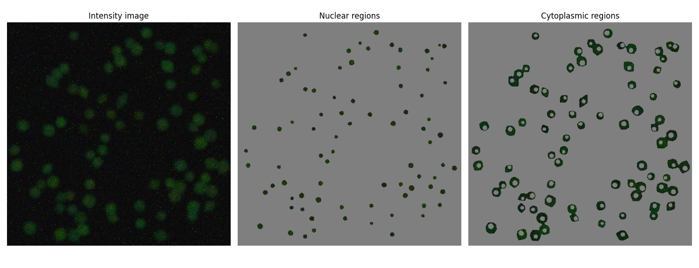

The extraction looks good, but it's still throwing an error?

:::

Really annoying LLM bug ahead:

:::solution

Looking at the diagnostic image from the previous solution block


The cells are clearly outlined in green, but in the definition of `extract_nuclear_cytoplasmic()`

```python nolint
def extract_nuclear_cytoplasmic(
    intensity_image: np.ndarray,
    track_entries: List[Tuple],
    nuclear_channel: str = "green",
    cytoplasmic_channel: str = "red",
) -> List[Dict[str, float]]:
```

it's been assigned as a default argument the wrong way around. Swapping them fixes this error.

:::
::::

### Error 5 at timepoint t the number of cells in the segmented image is >80, not 80

We've gone the other way from the first error, and are now assigning too many cells rather than too few.

::::challenge{id=f_err_5_diag title="Diagnosing and fixing the error"}

As before, let's write some code to catch what's happening. This is occuring in the segmentation logic, so lets plot that first

:::solution

If following along from previous solution blocks, this goes in `segment_cells()`

```python nolint
if cell_id > 80:  # Only want this to fire when too many nuceli have been found
    fig, ax_phase = plt.subplots()
    gray0 = phase_image
    phase_norm = gray0 / gray0.max() if gray0.max() > 0 else gray0
    ax_phase.imshow(color.label2rgb(labeled, image=phase_norm, bg_label=0, alpha=0.4))
    for entry in cell_atlas:
        min_row, min_col, max_row, max_col = entry["bbox"]
        ys, xs = np.where(entry["cell_mask"])  # Number goes in centre of bbox
        ax_phase.text(
            min_col + xs.mean(),
            min_row + ys.mean(),
            str(entry["cell_id"]),  # Now using the ID from cell_atlas
            color="white",
            fontsize=12,
            ha="center",
            va="center",
        )
    ax_phase.set_title("Phase image (timepoint 0)")
    plt.show()
```

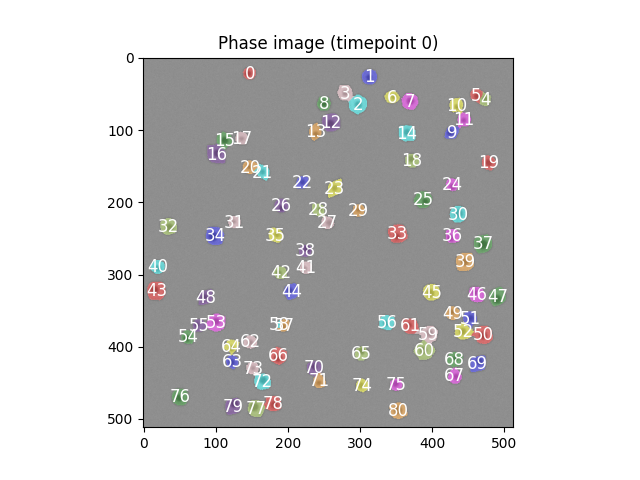

One cell has been assigned twice (id 57/58).

:::

Write some code to determine what is happening before this error.

:::solution

You can place this in the segmentation loop

```python nolint
fig, axes = plt.subplots(1, n_nuclei + 1, figsize=(4 * (n_nuclei + 1), 4))
axes[0].imshow(local_phase, cmap="gray")  # local bbox region
axes[0].imshow(nucleus_mask, alpha=0.4, cmap="Greens")  # nucleus mask
axes[0].set_title(f"cell {cell_id}: combined nucleus mask")
for nuc_idx in range(1, n_nuclei + 1):
    axes[nuc_idx].imshow(local_phase, cmap="gray")
    axes[nuc_idx].imshow(
        ws_labels == nuc_idx, alpha=0.4, cmap="Reds"
    )  # plotting the appropriate segmentation
    axes[nuc_idx].set_title(f"nucleus {nuc_idx}")
plt.tight_layout()
plt.show()
```

If this is happening at later timepoints, you can control which timepoint you start on by reducing the range of the test_images["phase_images"] list (this can cause other errors, but it's fine for debugging the segmentation code)
e.g.:

```python nolint
tracks = ra.fluorescence_extraction.track_cells_across_time(
    test_images["phase_images"][6:8], 5
)
```

If you keep on clicking through the cells, you'll eventually get something like this:

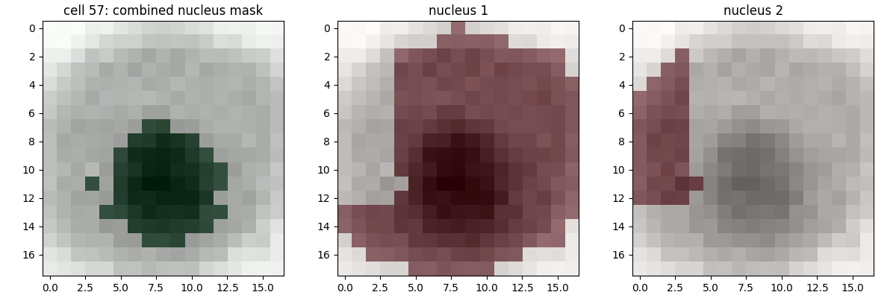

We can see from this that some stray unconnected pixels have been assigned as a nucleus.
:::
Create a fix for the error
:::solution
The fix is pretty easy:

```python nolint
nucleus_mask = morphology.remove_small_objects(nucleus_mask, max_size=min_cell_area)
nucleus_mask = morphology.remove_small_holes(nucleus_mask, max_size=min_cell_area)
```

:::
::::

### Error 6 at timepoint t the number of cells in the segmented image is <80, not 80

We're still having segmentation problems!

::::challenge{id=f_err_6_diag title="Diagnosing and fixing the error"}

Again, let's try and find which part of the segmentation code is breaking to cause this error. The initial diagnosis is identical to the previous solution:

```python nolint
if cell_id < 80:  # Only want this to fire when too many nuceli have been found
    fig, ax_phase = plt.subplots()
    gray0 = phase_image
    phase_norm = gray0 / gray0.max() if gray0.max() > 0 else gray0
    ax_phase.imshow(color.label2rgb(labeled, image=phase_norm, bg_label=0, alpha=0.4))
    for entry in cell_atlas:
        min_row, min_col, max_row, max_col = entry["bbox"]
        ys, xs = np.where(entry["cell_mask"])  # Number goes in centre of bbox
        ax_phase.text(
            min_col + xs.mean(),
            min_row + ys.mean(),
            str(entry["cell_id"]),  # Now using the ID from cell_atlas
            color="white",
            fontsize=12,
            ha="center",
            va="center",
        )
    ax_phase.set_title("Phase image (timepoint 0)")
    plt.show()
```

What is the source of the error this time?

:::solution

There are actually two errors here, one easier to fix than the other. The first is caused by cells being on the border of the image

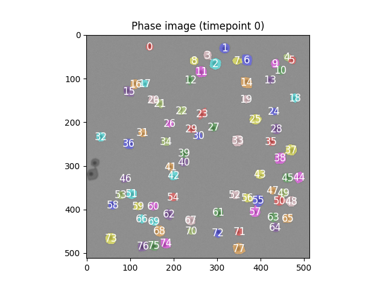

and the second is two cells being improperly assigned as one cell.

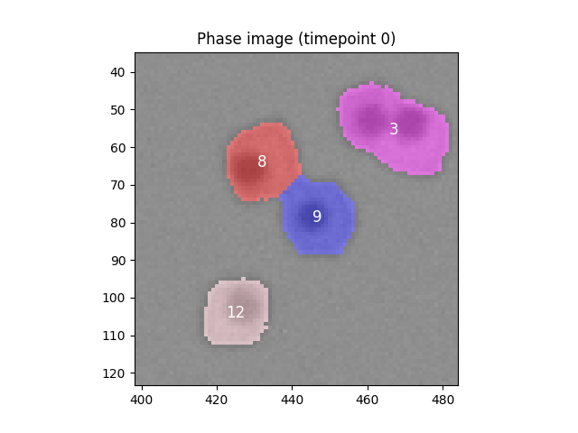

:::

Write some code to fix these errors.
Error 1:

:::solution

```python nolint
# Clear border objects (cells touching image edge)
"""We just comment out the below line to stop the border clear"""

# labeled = segmentation.clear_border(labeled)
```

:::

Diagnose the source of the second error

:::solution
This one is a bit trickier. First, let's just catch why the two cells aren't being segmented properly.

```python nolint
# after the segmentation code, under conditions where n_nuclei==1
fig, axes = plt.subplots(1, 2, figsize=(8, 4))
axes[0].imshow(local_phase, cmap="gray")
axes[0].set_title(f"cell {cell_id}: phase")
axes[1].imshow(local_phase, cmap="gray")
axes[1].imshow(nucleus_mask, alpha=1, cmap="Greens")
axes[1].set_title(f"cell {cell_id}: nucleus mask")
plt.tight_layout()
plt.show()
```

If you click through, you should eventually find:

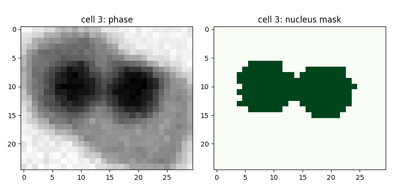

:::

Write some code to catch this error

:::solution
Eccentricity measures how elongated a shape is (0 = perfect circle, 1 = a straight line). Two nuclei that are just touching will appear as a single elongated blob, so a high eccentricity can be used to detect two touching nuclei.

```python nolint
# as a check before deciding whether to segment or not
labeled_nuclei = measure.label(nucleus_mask)
for nuc_prop in measure.regionprops(labeled_nuclei):
    if nuc_prop.eccentricity > 0.71:  # Determined with a bit of trial and error!
        n_nuclei += 1  # This means the cell will be passed to the n_nuclei>1 branch, and is important for the num_peaks keyword
```

(this is a little hacky, in that it doesn't account for what happens if you have three or more colliding nuclei, but it works for now!)
:::
::::

## Wrapping up

Once you're satisfied that all tests pass:

```bash
python -m pytest fluorescence_extractor_test.py::test_track_cells
```

Remove any diagnostic code you added to `fluorescence_extractor_test.py`, then merge your changes back into master:

```bash
git checkout master
git merge cell_tracking_fix
```
