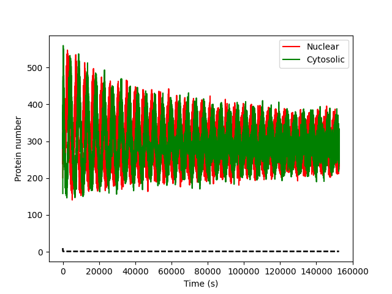
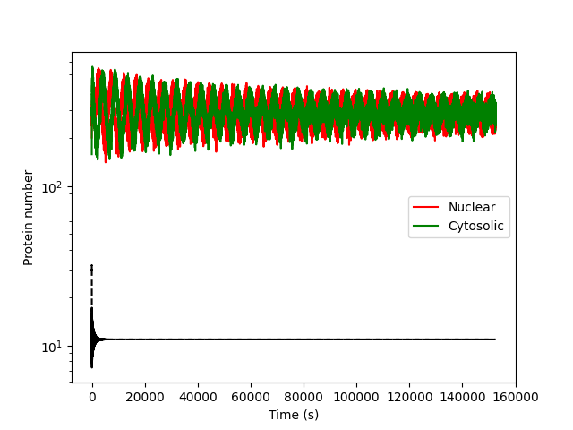
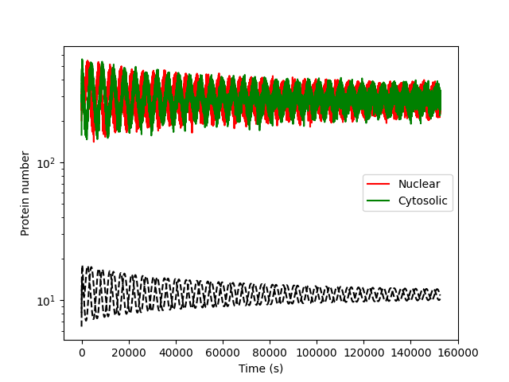
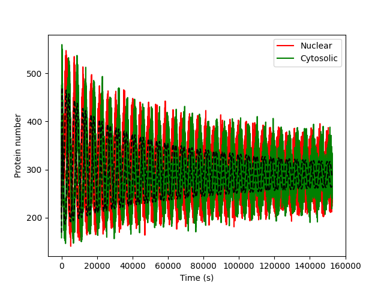

# ODE Simulation and Inference

The purpose of the functions in this module are to:

1. Take a set of parameters and times as input, and predict the number of each of the three proteins there will be at every timepoint (tested in `test_repressilator_simulation_class()`).
2. Take protein number traces as input, and determine by optimisation the governing parameters that generated them.

## Getting started

Navigate to `Repressilator_tests/tests` and verify that the test fails:

```bash
python -m pytest ode_inference_test.py
```

The inference code can take quite a long time to run, so you may just want to start by testing `test_repressilator_simulation_class()`. It's worth making a branch if you're changing the codebase:

```bash
git checkout -b ode_fix
```

Now we can make changes to the tests and `repressilator_analysis` module, and can choose to merge them back later. It's often worth being able to print test outputs, so you may like to add `test_repressilator_simulation_class()` to start with. You can then see the same test output by running:

```bash
python ode_simulation_and_inference.py
```

The repressilator paper can be found in the `docs/` folder.
You should read box 1 on page 3, which talks about the ordinary differential equation model.
As you read, note the form of the differential equations for mRNA and protein and which parameters are defined (α, α₀, β, n).
If you have not encoutered it before, you may be interested in the [Hill equation](https://en.wikipedia.org/wiki/Hill_equation_(biochemistry)) which is used in the ODE model to describe binding kinetics.

## The Test Functions

### `test_repressilator_simulation_class()`

Tests a function `simulate()` that is a member of a class `ode_inference.RepressilatorModel`. Even though the model simulates the number of all three proteins in the repressilator circuit, only two protein number values are assessed.

- **Arguments:**
  - A list of parameters, provided in the order defined by `RepressilatorModel._param_names`
  - The times of the experiment in seconds
- **Returns:** A `numpy.ndarray` of predicted protein numbers, with column 0 being the nuclear numbers and column 1 the cytosolic.

### `test_infer_parameters()`

Tests a single function: `ode_inference.infer_parameters()`

- **Arguments:**
  - A list of times in seconds (one-dimensional `numpy.ndarray`)
  - A two-dimensional `numpy.ndarray` of shape `(n_times, 2)` in the same format as returned by `ode_inference.RepressilatorModel.simulate()`
- **Returns:** A list of parameters in the same order as `RepressilatorModel._param_names`

## `test_repressilator_simulation_class()`

### AssertionError `assert RMSE(values[:,0], test_nuclear_protein)<36`

This indicates that the root mean squared error difference between the predicted and actual recorded protein numbers is greater than 36.

::::challenge{id=od_err_1_assess title="What is the code doing before the error?"}

First let's modify the test code to plot the protein numbers from `simulate()` vs. the protein numbers stored as test data

:::solution

```python nolint
# before the assert block in `test_repressilator_simulation_class()`
plt.plot(test_time_seconds, test_nuclear_protein, color="red", label="Nuclear")
plt.plot(test_time_seconds, values[:, 0], color="red", linestyle="--")
plt.plot(test_time_seconds, test_cytosol_protein, color="green", label="Cytosolic")
plt.plot(test_time_seconds, values[:, 1], color="green", linestyle="--")
plt.xlabel("Time (s)")
plt.ylabel("Protein number")
plt.legend()
plt.show()
```

Clearly a massive difference between the output of `simulate()` and the test data!



:::

Look at the actual `simulate()` function and understand what it does.

:::solution

1. Class declaration: Stores parameter names `["alpha", "alpha0", "beta", "hill", "mrna_half_life", "p_half_life"]` as a class attribute and accepts a
   times array on initialisation.
2. Convert half-lives to degradation rates: Computes `gamma_m` and `gamma_p` as `ln(2) / half_life` for mRNA and protein respectively.
3. Set initial conditions: Starts the 6-state system (`m1`, `m2`, `m3`, `p1`, `p2`, `p3`) at `[1, 1, 1, 10, 10, 10]`, referring to mRNA and protein quantities respectively.
4. Define ODE system: Implements the cyclic repression loop:
    - Each mRNA is produced via a Hill repression function (driven by the previous repressor protein) and degraded at rate `gamma_m`.
    - Each protein is translated from its corresponding mRNA at rate beta and degraded at rate `gamma_p`.
5. Integrate: Solves the ODE system using `scipy.integrate.odeint` over the provided time points.
6. Extract outputs: Returns only `p1` and `p2` as the two observable fluorescent proteins; `p3` is treated as unobserved.

:::

Compare the mRNA and protein equations from the code with the equations in box 1. Are they the same equation? Which terms differ?

:::solution

The ODE equations are different from those in the paper. In the code:

$$\frac{dm_i}{dt} = \frac{\alpha}{1 + p_j^n} + \alpha_0 - \gamma_{m_i}m_i $$

$$\frac{dp_i}{dt} = \beta m_i - \gamma_{p_i} p_i$$

But the paper equations are

$$\frac{dm_i}{dt} = \frac{\alpha}{1 + p_j^n} + \alpha_0 - m_i $$

$$\frac{dp_i}{dt} = \beta (m_i - p_i)$$

:::

Do the parameters used in the model (for example, those used in _param_names) agree with the description of box 1 in the paper?

:::solution

The box mentions the number of mRNA transcripts per cell, the number of protein molecules required to half repress a promoter and (now we have altered the differential equations) the two decay rates, all of which are unused by the LLM model.

::::

::::challenge{id=od_err_1_debug title="How can we resolve the error?"}

Let's change the simulation code to match the equations from the paper

:::solution

```python nolint
def hill_repression(repressor_conc):
    return alpha / (1 + (repressor_conc**hill)) + alpha0


# mRNA dynamics
dm1_dt = hill_repression(p3) - m1
dm2_dt = hill_repression(p1) - m2
dm3_dt = hill_repression(p2) - m3

# Protein dynamics
dp1_dt = beta * (m1 - p1)
dp2_dt = beta * (m2 - p2)
dp3_dt = beta * (m3 - p3)
```

Changing the code in `simulate()` to use the correct expression doesn't change very much, but at least the equations are consistent!

:::
If you inspect the parameters in the `params_003.json` file

```python nolint
# after `params` is loaded
for key in params.keys():
    print("{0}:{1}".format(key, params[key]))
```

you will notice that there are more parameter values than included in the _param_names list. Update the code to incorporate these values, according to the description of their usage in box 1 in the paper. `initial_` values refer to the initial values of `m1-3` and `p1-3` (where `n_x_1` is `x1`, `n_x_2` is `x_2` and `c_x` is `x3`, where `x` is either `m` or `p`), and `T_e` refers to the translation efficiency of an mRNA molecule. You can assume that all the transcription factors act as monomers (which is relevant in the context of the `K_m` parameter). Furthermore, the differential equation model is only valid after using the [non-dimensionalisation](https://en.wikipedia.org/wiki/Nondimensionalization) procedure outlined in the Elowitz paper. Non-dimensionalisation rescales the variables so that the equations have no physical units; it simplifies the maths and means the parameters (such as α) end up as dimnesionless values rather than quantities with awkward units. The paper describes how to do this; the key effect on the code is that time must be rescaled and α must be converted before being passed to the solver.

:::solution
First, we need to update _param_names so that it incorporates all the parameters in the `.json` file

```python nolint
_param_names = [
    "hill",  # hill coefficient (same for all)
    "mrna_half_life",  # half life of mRNA molecule (same for all)
    "p_half_life",  # half life of protein molecule (same for all)
    "K_m",  # Number of protein monomers (in this case, the same as the no. of proteins) required to half-maximally repress transcription
    "T_e",  # Transcription efficiency
    "initial_c_p",  # initial values
    "initial_n_p_1",
    "initial_n_p_2",
    "initial_c_m",
    "initial_n_m_1",
    "initial_n_m_2",
    "alpha",  # rate of transcription in unrepressed promoter minus alpha0
    "alpha0",  # rate of transcription in maximally repressed promoter
]
```

Then we need to incorporate these extra parameters into the model.

```python nolint
# pass the extra parameters in (same order as _param_names)
(
    hill,
    mrna_half_life,
    p_half_life,
    K_m,
    T_e,
    initial_c_p,
    initial_n_p_1,
    initial_n_p_2,
    initial_c_m,
    initial_n_m_1,
    initial_n_m_2,
    alpha,
    alpha0,
) = parameters
# degradation_rate = ln(2) / half_life
# mean lifetime= half_life/ln(2)
p_decay = np.log(2) / p_half_life
m_lifetime = mrna_half_life / np.log(2)
# \beta as in the paper
beta = mrna_half_life / p_half_life
# \alpha Non dimensionalisation:
# Reported alpha is transcript s^-1 cell^-1
# K_m monomers cell^-1
# T_e protein transcript ^-1
# p_decay min ^-1
# (transcript/(cell*s)*(s)*(protein/transcript)*(cell/monomer)
# For this exercise we're going to assume that the transcription repressors are all monomers, so monomer=protein.
# (transcript/(cell*s)*(s)*(protein/transcript)*(cell/protein)=1
alpha = alpha * (60 / p_decay) * T_e / K_m
# alpha is now dimensionless
alpha0 *= alpha
# Now maximal translation =alpha+alpha0
y0 = [
    initial_n_m_1,
    initial_n_m_2,
    initial_c_m,
    initial_n_p_1,
    initial_n_p_2,
    initial_c_p,
]
# Initial conditions are now modelled as a free parameter, rather than hard-coded
```

This still isn't quite right, but at least it's oscillating

:::
The rapid oscillation is because the time units still haven't been non-dimensionalised
:::solution

```python nolint
# "Time is rescaled in units of the mRNA lifetime"
# Half lives are reported in minutes, so need to be converted to seconds, which is the unit of the input time
nd_time = times / (m_lifetime * 60)


def repressilator_odes(y, t):
    """ODE system for the Repressilator."""
    m1, m2, m3, p1, p2, p3 = y

    # Hill function for repression
    def hill_repression(repressor_conc):
        return alpha / (1 + (repressor_conc**hill)) + alpha0

    # mRNA dynamics
    dm1_dt = hill_repression(p3) - m1
    dm2_dt = hill_repression(p1) - m2
    dm3_dt = hill_repression(p2) - m3

    # Protein dynamics
    dp1_dt = beta * (m1 - p1)
    dp2_dt = beta * (m2 - p2)
    dp3_dt = beta * (m3 - p3)

    return [dm1_dt, dm2_dt, dm3_dt, dp1_dt, dp2_dt, dp3_dt]

    # Solve ODE system
    solution = odeint(repressilator_odes, y0, nd_time)

    # As written here, we want n_p_1 (index 3) and c_p (index 5)
    output = solution[:, [3, 5]]  # [p1, p2]
```

This looks like it might be about right but it's out by a constant factor?

:::
In the previous solution block we're out by a constant factor; the differential equation model expresses proteins in units of K_m, but the test data is just raw protein count
:::solution
We just need to re-scale by the K_m value

```python nolint
output = solution[:, [3, 5]] * K_m0
```

to get a simulation that looks pretty close, and that will pass the `assert` test

:::
::::

## `test_infer_parameters()`

### KeyError or AssertionError `assert RMSE(sim[:,0], true_array[:,1])<36`

If you've been following along with the previous solution block, you'll get a KeyError, as the `_param_names` variable in `RepressilatorModel` is now incompatible - if you run the LLM code as-is, you'll get an assertion error. In the following solution blocks, I'm going to totally rewrite the code to make use of the PINTS (parameter inference for noisy timeseries) library and the CMA-ES algorithm, which is a robust gradient-free optimiser, because that's what I'm used to (and it can handle multiple columns). For any optimisation function, you will need to

1. Specify parameters, and the order with which they are fed into `simulate`
2. Specify parameter bounds (i.e. the parameter space in which the optimiser will search)
3. Specify the initial search point.
4. Specify optimiser options
5. Find some way of dealing with multiple output columns (as `simulate` returns the cytosolic and nuclear protein numbers)

I also usually include the following

1. Random initialisation
2. Multiple independent optimisation runs

::::challenge{id=od_err_2_debug title="Rewriting the inference code"}

The arguments to the function are as in the LLM implementation (although without optimiser choice)

```python nolint
def infer_parameters(
    times: np.ndarray,
    observations: np.ndarray,
):
```

and we setup the model in the same way

```python nolint
model = RepressilatorModel(times)
```

The next step is to define boundaries for each parameter. The actual simulation values are centred around the values given in the paper in the `docs` folder

:::solution

```python nolint
# Defining boundaries for the new parameters in _param_names
param_bounds = {
    "hill": (1.0, 3.0),
    "mrna_half_life": (1.0, 3.0),
    "p_half_life": (5.0, 15.0),
    "K_m": (20.0, 50.0),
    "T_e": (20.0, 40.0),
    "initial_c_p": (1.0, 50.0),
    "initial_n_p_1": (1.0, 50.0),
    "initial_n_p_2": (1.0, 50.0),
    "initial_c_m": (5.0, 150.0),
    "initial_n_m_1": (5.0, 150.0),
    "initial_n_m_2": (5.0, 150.0),
    "alpha": (0, 1),
    "alpha0": (0.0005, 0.002),
}
# In the same order as required for simulation
lower_bounds = [param_bounds[name][0] for name in model._param_names]
upper_bounds = [param_bounds[name][1] for name in model._param_names]
```

:::

We then need to set up the optimiser

:::solution

```python nolint
score = 1e23  # Arbitrarily large initial value
num_repeats = 3  # Some independent runs
for i in range(0, 3):
    # pick a random point between min and max for each element in _param_names, changes with each repeat
    x0 = [
        np.random.uniform(low=lower, high=upper, size=1)
        for lower, upper in zip(lower_bounds, upper_bounds)
    ]

    # Create error measure
    # To account for multiple columns
    problem = pints.MultiOutputProblem(model, times, observations)
    # Minimise squared error between simulations and data
    error = pints.SumOfSquaresError(problem)

    # Create boundaries
    boundaries = pints.RectangularBoundaries(lower_bounds, upper_bounds)

    # Run CMAES optimization
    opt = pints.OptimisationController(
        error, x0, boundaries=boundaries, method=pints.CMAES
    )
    # Will terminate when no change above 1e-1 for 200 iterations
    opt.set_max_unchanged_iterations(200, threshold=1e-1)
    opt.set_log_to_screen(True)
    # For speed
    opt.set_parallel(True)
    # Run optimization
    best_params, best_error = opt.run()
    # If score value lower than current best, then save
    if best_error < score:
        score = best_error
        params = best_params

return params  # outside the loop — returns the best result across all repeats
```

:::
::::

## Wrapping up

Once you're satisfied that all tests pass:

```bash
python -m pytest ode_inference_test.py
```

Remove any diagnostic code you added to `ode_inference_test.py`, then merge your changes back into master:

```bash
git checkout master
git merge ode_fix
```
