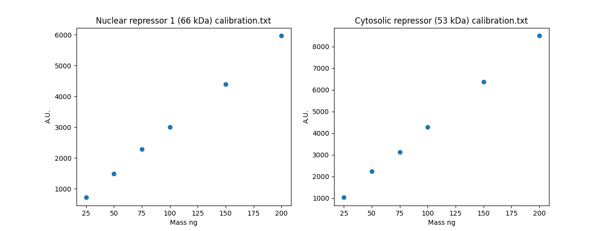
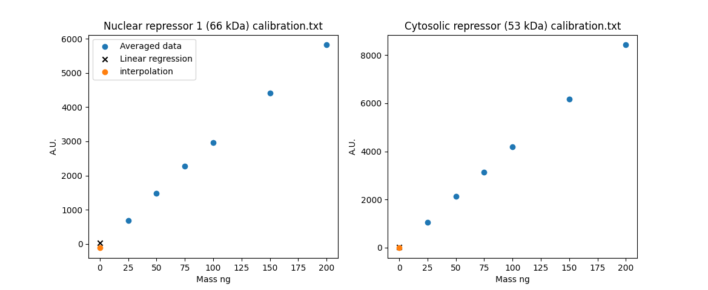

# Calibration

Fluorescence microscopy measures light intensity, but what we actually want to know is how many protein molecules are present in each cell.
A separate experiment has been run in which the fluorescence of known quantities of the relevant proteins were recorded, and we can use that data to build a conversion function.

## Getting started

Navigate to `Repressilator_tests/tests` and verify that the test fails:

```bash
python -m pytest calibration_test.py::test_calibration
```

We're going to be making changes to the codebase, so it's worth making a separate branch first:

```bash
git checkout -b calibration_fix
```

Now we can make changes to the tests and `repressilator_analysis` module, and can choose to merge them back later.
It's often worth being able to print test outputs, so you may like to add `test_calibration()` to the end of `calibration_test.py`.
You can then see the same test output by running:

```bash
python calibration_test.py
```

A description of how the calibration experiments were conducted can be found in `docs/calibration_experiment_analysis.txt`, along with the two `{protein_name}_calibration.txt` files.

## The test function

**`calibration.ProteinCalibration.pixel_intensities_to_molecules()`**

- **Arguments:** A pixel value (or an average of a number of pixel values)
- **Returns:** The number of protein molecules

## Debugging

**AssertionError `assert np.mean(np.abs(calculated_molecules-true_amounts))<200`**

::::challenge{id=what_code_does_cal title="What does the code do?"}
Examine `pixel_intensities_to_molecules()` method and identify what transformations are made to go from pixel value to protein numbers.

:::solution

1. pixel value = fluorescence A.U. (arbitrary units)
2. fluorescence A.U. -> mass (ng) this uses (a) [linear interpolation](https://en.wikipedia.org/wiki/Linear_interpolation) to convert between pixels and nanograms, and (b) CONVERSION_FACTOR to account for scale differences between the calibration and microscopy experiments.
3. mass (ng) $\times 10^{-9}$ = mass (g)
4. moles (mol) $= \dfrac{\text{mass (g)}}{\text{molecular weight (g mol}^{-1}\text{)}}$
5. number of molecules = moles (mol) x Avogadros constant

:::
::::

::::challenge{id=error_source_cal title="What is the source of the error?"}
We need to determine where has the sequence of transformations in steps 1-5 in the solution above gone wrong.
Plot the calibration data in the `docs/{protein_name}_calibration.txt` files.

:::solution
Add some diagnostic code to `test_calibration()`

```python nolint
fig, ax = plt.subplots(1, 2)
for i in range(0, len(calibrant_files)):
    calibrator = ra.calibration.ProteinCalibration(
        calibrant_files[i], weights[i], header=1
    )  # header to skip the table titles in the .txt files
    ax[i].scatter(calibrator.mass_ng, calibrator.fluorescence_au)
    ax[i].set_ylabel("A.U.")
    ax[i].set_xlabel("Mass ng")
    ax[i].set_title(calibrant_files[i])
    # ...Rest of script
    # comment out the `assert` line for now, as it will throw an error
plt.show()
```


Looks pretty linear - it's a little surprising if you looked at the `.txt` files, as these have three columns each, but there's only one scatter trace.
We can see there's a sneaky averaging step happening in `_load_calibration_file()`, which isn't necessarily what we want!
It doesn't affect the results here, but you generally don't want your "load" functions doing extra processing steps.
Hidden transformations buried in utility functions is a really insidous LLM coding feature to watch out for.
:::

Having seen the calibration data is linear, calculate the value in nanograms for 2000 proteins, and the expected A.U. value, assuming this linear relationship holds.
Place this as a scatter point on the graph (the 2000 order of magnitdue comes from fig.1 in the Repressilator paper in the `/docs/` folder).
Also place the LLM A.U. estimate on the graph, and print the values of both estimates.

:::solution

```python nolint
# mass_in_g=molar mass*molecule_no/avogadro
molar_mass = weights[i] * 1000  # kDa
molecule_no = 2000
avogadro = 6.02214076e23
mass_in_ng = (molar_mass * (molecule_no / avogadro)) / 1e-9
# Fit a linear polynomial to the existing ng/A.u. data (need to import scipy.stats)
slope, intercept, _, _, _ = stats.linregress(
    calibrator.mass_ng, calibrator.fluorescence_au
)
# Use the interpolation approach for comparison to find relationship between mass and A.U.
ifunc = interpolate.interp1d(
    calibrator.mass_ng,
    calibrator.fluorescence_au,
    kind="linear",
    fill_value="extrapolate",
)
predicted_AU_linear = (mass_in_ng * slope) + intercept
predicted_AU_interp = ifunc(mass_in_ng)
ax[i].scatter(mass_in_ng, predicted_AU_linear, marker="x", color="black")
ax[i].scatter(mass_in_ng, predicted_AU_interp)
print(
    "regression AU estimate=",
    predicted_AU_linear,
    "interpolation AU estimate=",
    predicted_AU_interp,
)
```

We can see from the output that the interpolation function gives negative values when extrapolating outside of the normal range.


```text
regression AU estimate= 21.194450844095943 interpolation AU estimate= -119.66665963355331
regression AU estimate= 20.84870015170366 interpolation AU estimate= -10.733325757321154
```

:::
::::

::::challenge{id=fixing_the_code_cal title="Fixing the Code"}

In the previous solution block, we determined that using interpolation at values far outside the interpolation range is unlikely to accurately capture the linear relationship between protein number and fluorescence.
Use an alternative approach, using the full dataset in the `docs/calibration` files (rather than averaging them, as the LLM implementation does).

:::solution
Let's first modify the`_load_calibration_file()` function to return the repeats without averaging

```python nolint
return mass_ng, repeats
```

Now let's use linear regression as in the previous solution block to convert between AU and mass (this is the inverse of the operation in the previous solution block i.e. from au->mass)

```python nolint
# In the `_init__()` function to replace the usage of interp1d
slope, intercept, _, _, _ = stats.linregress(
    np.repeat(self.mass_ng, 3), self.fluorescence_au.flatten()
)  # concatenates the three repeats
# pass gradient, intercept into class memory
self.slope = slope
self.intercept = intercept
```

we can then use these values in `pixel_intensities_to_molecules()`

```python nolint
mass_ng = ((pixel_intensities - self.intercept) / self.slope) / CONVERSION_FACTOR
```

:::
::::

## Wrapping up

Once you're satisfied that all tests pass:

```bash
python -m pytest calibration_test.py::test_calibration
```

Remove any diagnostic code you added to `calibration_test.py`, then merge your changes back into master:

```bash
git checkout master
git merge calibration_fix
```
